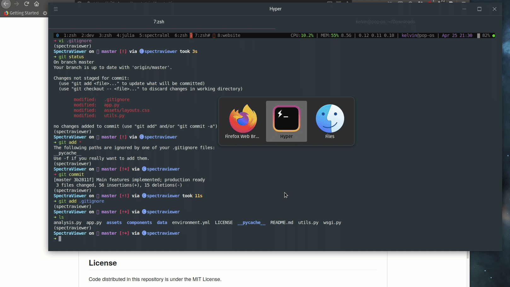

# SpectraViewer

Dash app for viewing legacy millimeter-wave spectroscopy data.

## Running locally

An `environment.yml` is provided which can be used by `conda` to create a new
Python environment with the necessary dependencies.

You can start the application by running `python app.py` in this directory.

## How it works

This Dash app is extremely lightweight and simple; it has functions to read in
the file format corresponding to old millimeter-wave data from the Thaddeus/McCarthy
group at the Harvard-Smithsonian Center for Astrophysics. Once this data is parsed,
it is serialized into NetCDF4 files through `xarray`, which will be the main form
of interaction throughout the application.

Once a valid file is uploaded, it will display the parsed spectrum and corresponding
time domain data in the plots. Only the real component of the Fourier transform is
used. To use the FFT filter used in legacy analysis, you can click to zoom in a region
of the time-domain panel, which will then produce a new plot corresponding to the
filtered data. Typically, we try and avoid large impulse noise (likely owing to the
electrical discharge), and the more of the time-domain data you include, the larger
the contribution from DC noise.

## License

Code distributed in this repository is under the MIT License.
